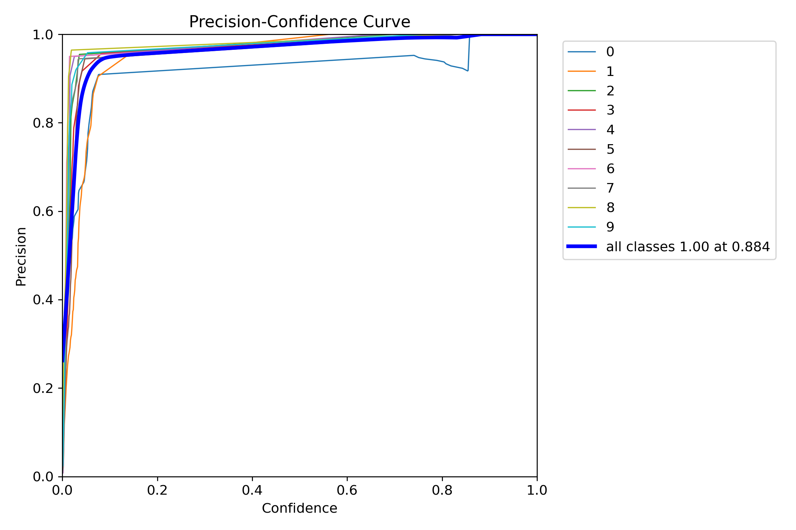

# CAPTCHA Solver (Digit-Only)

[](https://www.python.org/)
[](https://github.com/ultralytics/ultralytics)

This project demonstrates how to build a deep learning model using YOLOv8 to automatically detect and recognize digits in CAPTCHA images.
It highlights skills in data preparation, model training, evaluation, and inference deployment.

---

## Dataset
- **Data Preparation**: The dataset was manually annotated to create precise bounding boxes around each digit using Roboflow. This process ensured high-quality, ground-truth data essential for training the object detection model.
- Images are organized in **YOLO format** with corresponding labels:
```
data/processed/
        ├── train/
        │   ├── images/
        │   └── labels/
        ├── valid/
        │   ├── images/
        │   └── labels/
        └── test/
            ├── images/
            └── labels/
```
- `data.yaml` specifies dataset paths for YOLO training/validation/testing

---

## Project Highlights

This project implements an **automatic CAPTCHA solver** that detects and recognizes digits in CAPTCHA images using **YOLOv8** object detection.  

The pipeline includes:
1. **Dataset preparation** – custom labeled CAPTCHA dataset (digits 0–9)
2. **Model training** – YOLOv8 trained on the annotated dataset
3. **Evaluation** – precision, recall, F1-score, mAP metrics
4. **Inference/Solving** – detecting digits in new CAPTCHA images
5. **Visualization** – annotated images with bounding boxes and predicted digits
 
<p align="center">
  
</p>
<p align="center"> <em>Demonstration: Example of YOLOv8 successfully solving a CAPTCHA by detecting each digit and labeling it with the correct class (0-9).</em>
</p>

## Features

- Object detection for digits only (0–9)
- Easy-to-use training, evaluation, and inference scripts
- Modular and professional code structure
- Logging system for tracking progress and debugging
- Portfolio-ready results folder with metrics and plots

---

---

## Tech Stack

| Component        | Tool                                                           |
| ---------------- | -------------------------------------------------------------- |
| Object Detection | [YOLOv8](https://github.com/ultralytics/ultralytics)           |
| Data Labeling    | Roboflow(Used for manual annotation and dataset versioning)    |
| Framework        | PyTorch                                                        |
| Environment      | Python 3.10+                                                   |
| Visualization    | Matplotlib, OpenCV                                             |

---

## Project Structure

```
├── data
│   └── processed
│       ├── test
│       │   ├── images/
│       │   └── labels/
│       ├── train
│       │   ├── images/
│       │   └── labels/
│       ├── valid
│       │   ├── images/
│       │   └── labels/
│       └── data.yaml
├── assets
│   └── captcha_inference_example.jpg
├── logs
│   └── .gitkeep
├── model
│   ├── results
│   │   ├── evaluation/
│   │   ├── predictions/
│   │   ├── training/
│   │   └── .gitkeep
│   └── weights/
│       └── .gitkeep
├── src
│   ├── utils
│   │   └── logger.py
│   ├── config.py
│   ├── evaluate.py
│   ├── inference.py
│   └── train.py
├── .gitignore
├── readme.md
├── requirements.txt
└── run.py
```

---

## Installation

1. Clone the repository:
```bash
git clone https://github.com/yourusername/captcha_solver.git
cd captcha_solver
```
2. Create a virtual environment and activate it:
```bash
python -m venv venv
source venv/bin/activate   # Linux/macOS
venv\Scripts\activate      # Windows
```
3. Install dependencies:
```bash
pip install -r requirements.txt
```
---

## Usage
1. Training
```bash
python run.py train
```
- Trains YOLOv8 on the CAPTCHA dataset
- Saves best.pt and last.pt in model/
- All training logs and results saved in results/train/

2. Evaluation
```bash
python run.py evaluate
```
**Requirements**: model/best.pt must exist (run training first).
- Computes metrics: mAP, precision, recall, F1-score
- Saves evaluation plots and metrics in results/evaluation/
- Logs evaluation progress in console and results/logs/project.log

3. CAPTCHA Solving (Inference)
```bash
python run.py solve --image path/to/captcha_image.jpg --conf 0.3
```
**Parameters**:
- --image (required): Path to the CAPTCHA image
- --conf (optional): Detection confidence threshold (default: 0.25)
**Requirements**: model/best.pt must exist (run training first).
**Outputs**:
- Annotated image with bounding boxes in results/predictions/
- Digits recognized in left-to-right order logged to console

---

## Model Evaluation
 
After training, the model was evaluated on the test dataset using standard YOLOv8 metrics:
 
| Metric              | Score  |
|---------------------|--------|
| **Precision (B)**   | 0.987  |
| **Recall (B)**      | 0.999  |
| **mAP@0.5 (B)**     | 0.993  |
| **mAP@0.5:0.95 (B)**| 0.816  |
| **Fitness**         | 0.834  |
 
These results demonstrate **high detection accuracy and consistency** across all digit classes (0–9).

---

### Precision–Confidence Curve
 
<p align="center">

</p>
<p align="center"><em>Model achieves high precision across all digit classes, showing strong generalization and confidence calibration.</em></p>

---

## Credits
**Created by:** Israa Elhouch
**Contact:** issrach235@gmail.com  
**GitHub:** [github.com/israahch](https://github.com/israahch)
